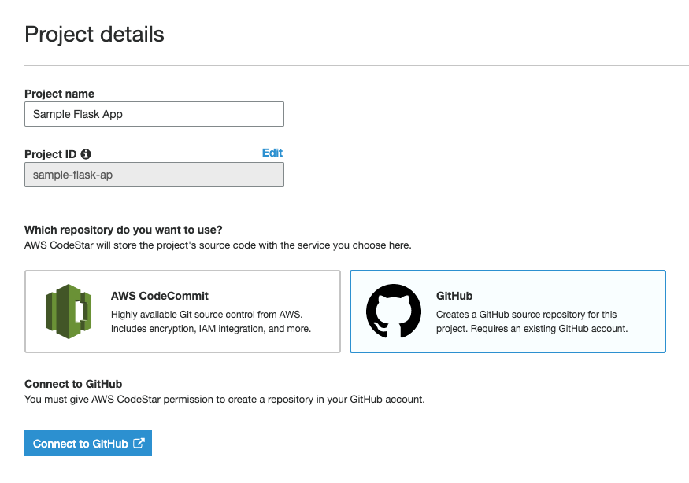
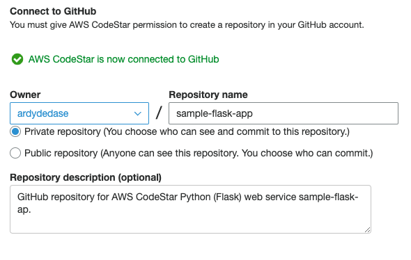
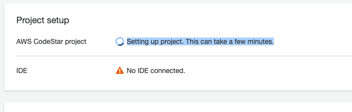

# AWS Codestar with Python Flask Project

At the end of this tutorial, you will be able to push your code changes to Github and run it in an EC2 instance deployed AWS CodeBuild.

All of AWS services in this tutorial should be in the same region Singapore (ap-southeast-1).

## Pre-requisites
- Github Account
- AWS Account
- AWS EC2 Key Pair. [Follow this tutorial](https://docs.aws.amazon.com/AWSEC2/latest/UserGuide/ec2-key-pairs.html#having-ec2-create-your-key-pair) and take note of your Key Pair.

## Step by step guide - basic CodeStar setup

1. Open [AWS Codestar](https://console.aws.amazon.com/codestar/home).

1. Click "Create a new project".

1. Choose Python (Flask) Web server / Amazon EC2.

1. Enter your Project Details.

1. Choose GitHub as your repository.

1. Click "Connect to GitHub" button.

    

1. Enter your GitHub reporitory details.

    

1. After reviewing the project details, click "Create Project". This will automatically create the GitHub repository for you. You can visit GitHub afterwards to see your repository.

1. Click "Next" button, you will be redirected to the Project setup page. Try to refresh the page to see if the project setup has finished.

    

1. In the lower right side of the Project setup page, the application endpoint will show up when the deployment has finished loading. You can check the deployment status in the Continuous deployment section.

1. Click the Application Endpoint when it is ready and you should be able to see the JSON response of your Flask API.

1. Try to make some changes to your GithHub repository push it to GitHub. Observe the deployment pipeline and refresh your Application Endpoint.

## Step by step guide - GitHub, CodeBuild, CodeDeploy and ECS

Based on [this documentation]() with additional services.

1. 

Notes

Make sure that the ECS cLuster and load balancer exist first

note the role name

create a cluster first

add role to ECR

Attach policy

privilege mode

https://github.com/aws/aws-codebuild-docker-images/issues/164#issuecomment-460324202

https://docs.aws.amazon.com/codebuild/latest/userguide/sample-docker-custom-image.html#sample-docker-custom-image-files

choose bridge port

setup the security groups

Security Group with description "ECS Allowed Ports"

Choose the security gropu of your load balancer

vpc-0e841d34766e1ac4e

After creating the ECS cluster - take note of the VPC
Load balancer should have the same VPC and security Group