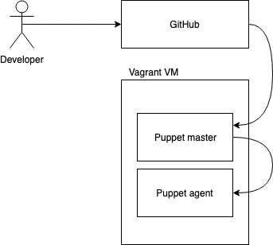

# Infrastructure as Code with Puppet

This is based on [this step-by-step guide](https://github.com/ardydedase/devops/blob/master/puppet/README.md).

This exercise is meant to help you understand how Infrastructure as code works using Puppet.

## Pre-requisites

- A GitHub account.
- You have cloned this repo locally: [https://github.com/ardydedase/devops](https://github.com/ardydedase/devops)
- Install [VirtualBox](https://www.virtualbox.org/wiki/Downloads)
- Install [Vagrant](https://www.vagrantup.com/downloads.html)
    - Note that Windows users might need to logout and login again.

## High level design

- Puppet master and agent will be in the same VM.
- rk10 will be used so we can easily organise our Puppet files in one Github repository.

    

## Sandbox for Puppet Master Setup

1. Make sure you are in the `puppet` directory of the repository.

    ```
    cd puppet
    ```

1. Start the VM. Make sure you are int the `puppet` folder where there is a `Vagrantfile`. This will take a while if you are running it for the first time.

    ```
    vagrant up
    ```

1. When the machine is ready after it has finished booting up. Login / ssh to the machine.

    ```
    vagrant ssh
    ```

1. Switch to root user.

    ```
    sudo su
    ```

1. Install what we need: Puppet server package, nano and git. `nano` can be replaced with an editor of your choice e.g. `vim`. Using `nano` here for simplicity.

    ```
    rpm -Uvh https://yum.puppetlabs.com/puppet5/puppet5-release-el-7.noarch.rpm

    yum install -y puppetserver nano git
    ```

1. Open the puppet the server configuration.

    When using `nano`. Press CTRL + x to choose your option.
    `nano` will then ask you if you want to save your changes

    ```
    nano -b /etc/sysconfig/puppetserver
    ```

1. Replace the memory allocation value in `JAVA_ARGS` with what we will need for this exercise.

    Original `JAVA_ARGS` value:

    ```
    JAVA_ARGS="-Xms2g -Xmx2g -Djruby.logger.class=com.puppetlabs.jruby_utils.jruby.Slf4jLogger"
    ```

    Modified `JAVA_ARGS` value:

    ```
    JAVA_ARGS="-Xms512m -Xmx512m -Djruby.logger.class=com.puppetlabs.jruby_utils.jruby.Slf4jLogger"
    ```

1. Start puppet server. This might take around 1-2 minutes the first time you start it.

    ```
    systemctl start puppetserver
    systemctl enable puppetserver
    ```

1. Configure the puppet server host. Edit the `puppet.conf` file.

    ```
    nano -b /etc/puppetlabs/puppet/puppet.conf
    ```

1. Add the following at the bottom of the conf file. We need to tell our agent which server to point to as master. For this exercise, it should point to itself. `master.puppet.vm` matches our Vagrant hostname.

    ```
    [agent]
    server = master.puppet.vm
    ```

1. Edit bash_profile to update the `PATH` value.

    ```
    nano -b .bash_profile
    ```

1. The updated `PATH` value should look like the following.

    ```
    PATH=$PATH:/opt/puppetlabs/puppet/bin:$HOME/.local/bin:$HOME/bin
    ```

1. Load the changes in the current terminal session.

    ```
    source .bash_profile
    ```

1. `gem` should be accessible by now.

    ```
    gem --help
    ```

1. Install `r10k`. This will be used for deployment and integration with our version control.

    ```
    gem install r10k
    ```

## GitHub public repo setup

It's best practice to version control every change to puppet changes. This exercise is meant to demonstrate a common good practice in provisioning servers using Puppet.

This is the basis of the r10k control repo that we will use here: https://github.com/puppetlabs/control-repo.

1. Create your own `contro-repo` in GitHub using its web interface. Add a `README.md` file. We will use `production` branch instead of `master` to avoid confusion with puppet's `master`. Make sure that this repository is public.

1. Configure your `r10k`. Copy the file from [r10k/r10k.yaml](r10k/r10k.yaml) into the directory you have created.

    ```
    mkdir /etc/puppetlabs/r10k
    ```
1. Create the r10k configuration file.

    ```
    touch /etc/puppetlabs/r10k/r10k.yaml
    nano -b /etc/puppetlabs/r10k/r10k.yaml
    ```
    Paste the following cofiguration to the `r10k.yaml` file. 
    Replacing the `$YOUR_GITHUB_USERNAME$` with your own GitHub username.

    ```
    ---
    # Cached git repos
    :cachedir: '/var/cache/r10k'

    # Repos. clones git repo
    :sources:
    # branch => environment  mapping in /etc/puppetlabs/code/environments
    # replace username with your github username
    :my-org:
        remote: 'https://github.com/$YOUR_GITHUB_USERNAME$/control-repo.git'
        basedir: '/etc/puppetlabs/code/environments'    
    ```

1. Update the remote git repository to point to the git repository that you have created above e.g. You can try to edit the `README.md` file for now to test if it works with our setup.

1. Deploy the changes from GitHub.

    ```
    r10k deploy environment -p
    ```

1. Check if the code is there. Ensure that the `README.md` file is present in the directory.

    ```
    ls -al /etc/puppetlabs/code/environments/
    ```

1. Create `manifests/site.pp` in Github repo. We can edit directly from GitHub's web interface. Paste the code below to the file. Commit your changes.

    ```
    node default {
        file { '/root/README.md':
            ensure  => file,
            content => 'This should exist',
            owner   => 'root',
        }
    }
    ```

1. Run the following commands to deploy your changes.

    ```
    r10k deploy environment -p

    puppet agent -t
    ```

1. Check if the file is present in your VM:

    ```
    cat /root/README.md
    ```

## Try to break the deployment
1. Add the code below in to the default node and redeploy your control-repo with r10k.

    ```
    file { '/root/README.md':
        owner   => 'root',
    }
    ```

1. So your default node will look like this.

    ```
    node default {
        file { '/root/README.md':
            ensure  => file,
            content => 'This should exist',
            owner   => 'root',
        }
        file { '/root/README.md':
            owner   => 'root',
        }        
    }
    ```

1. Re-deploy your changes.

    ```
    r10k deploy environment -p
    puppet agent -t
    ```

You should get an error at this point. Revert your changes in GitHub and re-deploy.

## Puppet modules

1. Create a `Puppetfile` in the root directory of your control-repo. Commit your changes.

    ```
    mod 'puppet/nodejs'
    mod 'puppet/mongodb'
    mod 'puppetlabs/stdlib'
    mod 'puppetlabs/apt'
    ```

1. Deploy your changes from your repo to your virtual machine.

    ```
    r10k deploy environment -p
    puppet agent -t
    ```

1. Check if your modules were successfully provisioned.

    ```
    ls -al /etc/puppetlabs/code/environments/production/modulesls mo
    ```

1. Create a `node.pp` file in the manifests folder of your control repo with the following class to install nodejs using Puppet:

    ```
    class { 'nodejs': }
    ```

1. Deploy your changes from repo to your virtual machine.

    ```
    r10k deploy environment -p
    puppet agent -t
    ```

1. Check that your nodejs application is installed.

    ```
    node --version
    ```

More learning resources in: [https://learn.puppet.com/](https://learn.puppet.com/)